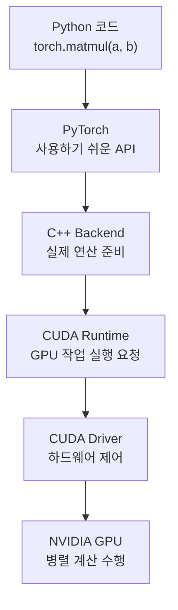

최근 AI 산업은 NVIDIA가 사실상 독주하고 있다.

그래서 자연스럽게 이런 의문이 생긴다.

> AMD가 앞으로 5~10년 안에 NVIDIA를 따라잡거나 의미 있는 점유율을 확보할 수 있을까?

처음에는 단순히 GPU 성능만 좋아지면 가능하다고 생각했다.

- AMD가 더 혁신적인 GPU를 만든다면?
- NVIDIA보다 성능이 뛰어난 AI 칩이 나온다면?
- 그렇다면 Ryzen 성공처럼 AI GPU에서도 큰 변화가 생기지 않을까?

실제로 AMD는 Ryzen과 EPYC를 통해 CPU 시장에서 Intel의 점유율을 가져온 경험이 있다.
그래서 AI GPU도 비슷한 일이 반복될 수 있지 않을까 하는 기대가 생겼다.

그런데 CUDA와 AI 생태계를 살펴보면서 생각이 조금 달라졌다.

AI 시장에서는 GPU 성능만으로 승부가 나지 않는다.
NVIDIA의 진짜 경쟁력은 GPU 칩 그 자체보다 **CUDA를 중심으로 한 소프트웨어 플랫폼**에 가깝다.

AMD를 장기 투자 관점에서 보려면 GPU 성능, FLOPS, 소비전력만 볼 게 아니라
ROCm 생태계, PyTorch/JAX 지원, 대형 AI 기업의 채택 여부, CUDA 의존성이 얼마나 줄어드는지도 같이 봐야 한다.

그래서 먼저 CUDA가 무엇인지, 그리고 내 코드가 어떻게 GPU까지 내려가는지 감을 잡아보려고 한다.

AI 쪽 글을 보다 보면 CUDA, GPU Runtime, Driver, cuDNN 같은 단어가 계속 나온다.

처음에는 "GPU 빠른 건 알겠는데, 내 Python 코드가 어떻게 GPU까지 가는 거지?" 싶었다.
Spring/Java 개발자 관점으로 보면 생각보다 익숙한 구조다.

## Spring 개발자에게 익숙한 비유

우리가 Spring Data Repository 를 쓴다고 해서 직접 TCP 패킷을 만들어 MySQL 에 보내지는 않는다.

대충 이런 식이다.

```text
내 Java 코드
  ↓
Spring Data Repository
  ↓
JPA / Hibernate
  ↓
JDBC
  ↓
MySQL Driver
  ↓
MySQL
```

개발자는 `repository.findById()` 를 호출하지만, 아래에서는 여러 계층이 일을 나눠서 처리한다.

GPU 도 비슷하다.

```text
내 Python 코드
  ↓
PyTorch / TensorFlow
  ↓
C++ Backend
  ↓
CUDA Runtime
  ↓
CUDA Driver
  ↓
NVIDIA GPU
```

내가 Python 에서 `tensor.to("cuda")` 같은 코드를 쓰면 GPU 에 직접 명령을 꽂는 것처럼 보이지만,
실제로는 PyTorch 가 CUDA Runtime 을 호출하고, CUDA Driver 가 GPU 에 작업을 전달한다.

## 그림으로 보면



핵심은 Python 이 계산을 직접 하는 게 아니라는 점이다.
Python 은 "이 행렬 곱 좀 해줘" 라고 요청하고, 실제 무거운 계산은 GPU 가 한다.

## CUDA는 단순 라이브러리가 아니다

CUDA 를 그냥 `npm package` 같은 라이브러리로 생각하면 조금 작게 보는 것이다.

CUDA 는 NVIDIA GPU 를 코드로 다룰 수 있게 열어주는 플랫폼에 가깝다.

- GPU 에 작업을 보내는 Runtime
- GPU 를 실제로 제어하는 Driver
- 행렬 연산용 cuBLAS
- 딥러닝 연산용 cuDNN
- 여러 GPU 를 묶는 NCCL
- 추론 최적화용 TensorRT
- 컴파일러와 디버깅 도구

즉 CUDA 는 "GPU 를 AI 개발자가 쓸 수 있는 서버 자원처럼 만들어주는 계층" 이다.

## 그런데 왜 표준 GPU API가 없을까?

DB 세계에는 SQL 이 있고, 웹에는 HTTP 가 있다.
물론 완벽하진 않아도 개발자가 기대하는 공통 감각이 있다.

그런데 GPU 연산 쪽은 아직 그런 강력한 표준 API 가 약하다.

```text
NVIDIA -> CUDA
AMD    -> ROCm / HIP
Intel  -> oneAPI / SYCL
Apple  -> Metal
Google -> XLA / TPU Runtime
```

OpenCL, SYCL 같은 표준 시도는 있다.
하지만 AI 개발 현장에서 CUDA 만큼 압도적인 사실상 표준이 되지는 못했다.

원인은 몇 가지로 보인다.

- GPU 구조가 회사마다 다르다. 메모리 구조, 명령어, 통신 방식, 최적화 포인트가 다르다.
- 성능이 너무 중요하다. 공통 API 로 예쁘게 추상화하면 편하지만, 최고 성능을 내려면 제조사별 최적화가 필요하다.
- 라이브러리까지 묶여 있다. CUDA 는 Runtime 만이 아니라 cuDNN, cuBLAS, NCCL, TensorRT 같은 주변 생태계가 같이 움직인다.
- 먼저 자리 잡은 쪽이 유리하다. 논문, 예제 코드, Docker image, 클라우드 환경, 채용 시장까지 CUDA 기준으로 쌓였다.
- 제조사도 굳이 완전한 표준화를 원하지 않는다. 좋은 생태계는 고객을 붙잡아두는 해자가 되기 때문이다.

결국 문제는 "GPU 명령을 보내는 API 하나"가 아니다.
AI 모델을 학습하고 운영하는 전체 경로가 이미 특정 생태계에 맞춰져 있다는 점이 더 크다.

## GPU를 코드로 컨트롤한다는 것

CPU 는 보통 순서대로 일을 잘 처리한다.
반면 GPU 는 같은 종류의 계산을 엄청 많이 동시에 처리하는 데 강하다.

예를 들어 이미지의 모든 픽셀을 바꾸거나, 큰 행렬을 곱하거나, 수많은 벡터 연산을 하는 일은 GPU 에 잘 맞는다.

코드 입장에서는 이런 느낌이다.

```python
import torch

a = torch.randn(10000, 10000).to("cuda")
b = torch.randn(10000, 10000).to("cuda")

c = a @ b
```

여기서 `to("cuda")` 는 데이터를 GPU 메모리로 옮긴다는 뜻이다.
그리고 `a @ b` 는 PyTorch 가 CUDA 생태계의 연산 라이브러리를 통해 GPU 에 계산을 맡긴다.

개발자는 짧은 Python 코드를 쓰지만, 아래에서는 메모리 이동, 커널 실행, 병렬 연산, 결과 동기화 같은 일이 벌어진다.

## NVIDIA의 강점은 GPU만이 아니다

AMD 가 좋은 GPU 를 만들어도 바로 NVIDIA 를 따라잡기 어려운 이유가 여기에 있다.

AI 개발자는 칩만 쓰는 게 아니라 전체 개발 경험을 쓴다.

```text
GPU 성능
  +
Driver 안정성
  +
CUDA / ROCm 같은 Runtime
  +
cuDNN / NCCL 같은 라이브러리
  +
PyTorch 지원
  +
운영 도구와 레퍼런스
```

NVIDIA 의 해자는 이 전체 묶음이다.
CUDA 는 GPU 를 코드로 제어하는 문을 열어줬고, 그 문 주변에 AI 개발 생태계를 크게 쌓았다.

## 앞으로 5~10년은 어떻게 움직일까?

개인적인 예측은 이렇다.

NVIDIA 는 CUDA 를 더 강하게 잠그기보다는, 더 높은 레벨의 플랫폼으로 끌어올릴 가능성이 크다.
개발자가 CUDA 를 직접 만지지 않아도 PyTorch, TensorRT, Triton, 클라우드 SDK, 엔터프라이즈 도구를 통해
자연스럽게 NVIDIA 위에서 돌게 만드는 방향이다.

즉 "CUDA 를 배워야만 NVIDIA 를 쓴다"가 아니라
"그냥 제일 편한 길로 가면 NVIDIA 였다"에 가까워질 수 있다.

AMD 는 반대로 CUDA 의존성을 낮추는 쪽에 집중할 가능성이 크다.
ROCm 을 키우고, HIP 으로 CUDA 코드를 옮기기 쉽게 만들고, PyTorch/JAX 같은 상위 프레임워크 지원을 강화하는 식이다.

AMD 가 이기려면 개발자가 이런 생각을 해야 한다.

```text
굳이 CUDA 를 직접 신경 쓰지 않아도
내 PyTorch 코드가 AMD GPU 에서 잘 돈다.
성능도 충분하고, 설치와 운영도 크게 어렵지 않다.
```

그래서 앞으로의 핵심은 표준 GPU API 가 갑자기 하나로 통일되는지가 아닐 수 있다.
오히려 PyTorch, JAX, MLIR, XLA 같은 상위 계층이 제조사 차이를 얼마나 가려주느냐가 중요해 보인다.

5~10년 뒤에도 CUDA 는 쉽게 사라지지 않을 것 같다.
다만 개발자가 CUDA 를 직접 의식하는 비중은 줄고, 프레임워크와 클라우드가 아래 GPU 생태계를 선택해주는 방향으로 갈 가능성이 크다.

그 흐름이 강해질수록 AMD 에는 기회가 생긴다.
반대로 NVIDIA 가 상위 도구와 운영 경험까지 계속 앞서가면, CUDA 해자는 이름만 바뀐 채 더 넓어질 수도 있다.

## 정리

CUDA 는 "GPU 용 JDBC Driver" 정도로만 보기에는 훨씬 크다.

Spring 개발자가 Repository 뒤의 JPA, JDBC, DB Driver 를 매일 의식하지 않아도 DB 를 쓰듯이,
AI 개발자는 PyTorch 뒤의 CUDA Runtime, Driver, cuDNN 을 매번 의식하지 않아도 GPU 를 쓴다.

다만 성능 문제나 인프라 문제를 만나면 결국 아래 계층을 알아야 한다.
그래서 CUDA 를 이해한다는 건 단순히 NVIDIA 기술 하나를 아는 게 아니라,
"내 코드가 어떻게 GPU 라는 하드웨어 자원까지 내려가는지" 감을 잡는 일에 가깝다.

AMD 장기 투자 관점에서는 결국 이 질문으로 돌아온다.

```text
AI 개발자가 NVIDIA 생태계를 떠나도 불편하지 않은 날이 올까?
```

그 답이 "그렇다"에 가까워질수록 AMD 의 기회는 커지고,
"아직 CUDA 쪽이 제일 편하다"에 머물수록 NVIDIA 의 해자는 유지될 가능성이 높다.
