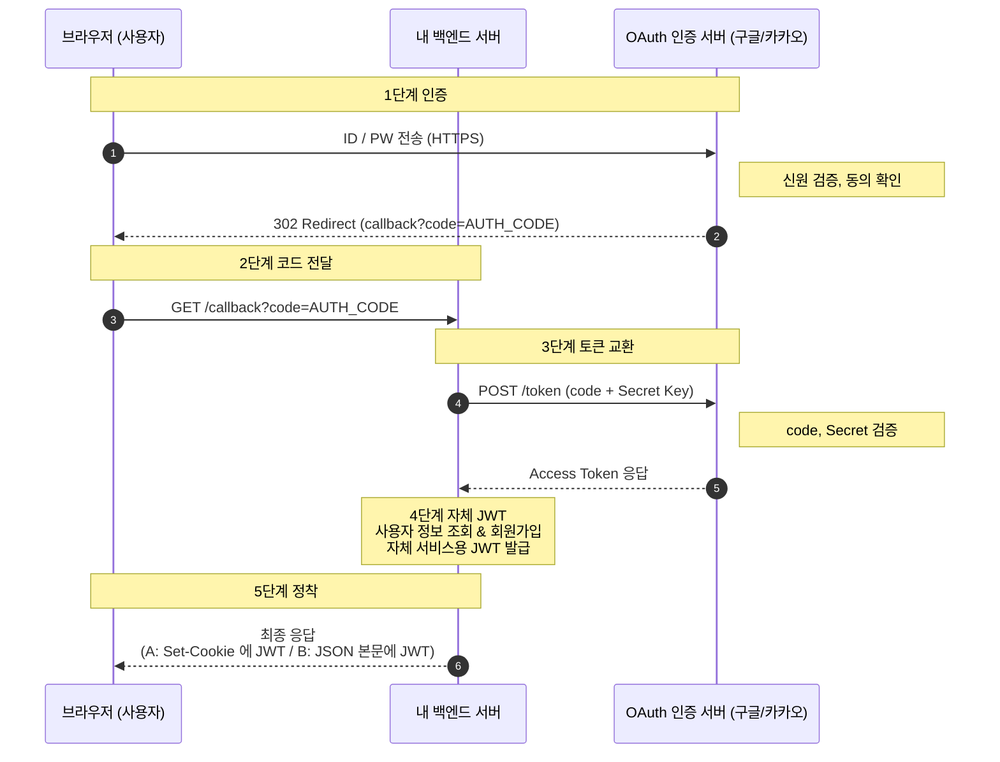

[내 맘대로 팀 입사 교육과정]()의 Python / FastAPI 버전.
Spring 파트는 빼고 파이썬 / FastAPI 로 바꿔서 짜봤다.

1. 코딩 스타일과 팀 생활
- 동료와 개발 의견이 다를땐 어떻게 해야하나.. 저도 아직 잘 모르겠음.
  - 코딩 스타일의 차이가 있을 때
  - 설계 차이가 있을 때
- 모르는건 동료 개발자에게 바로 물어봐야할까?
- 계몽 vs 전염 뭐가 더 좋은지 의미 생각해보기
- 성장한다는건 뭘 하는걸까
  - 새로운것을 배움? 과거의 잔재를 버림?
- 개발자의 역할은 뭘까
  - 요구되는 비즈니스 구현이 먼저냐 vs 기술부채 해결하여 안정적이고 우아한 시스템 구현이 먼저냐
- 예쁜 문서화가 업무에 영향을 미치는 것
  - 맨날 변하는 스펙 문서화하는게 시간이 너무 걸리는데 어떡하지?
- 이 교육에서 배운 지식들을 업무에 어떻게 녹일 수 있는지

2. 네트워크
- naver.com 브라우저 쳤을때 일어나는일
- 라우터들과 패킷
  - 요청은 패킷으로 왜 나눠보낼까
  - 해저광케이블
- DNS 등록과정
- HTTP
  - stateless
  - [HTTPS](https://aws-hyoh.tistory.com/38)
  - HTTP 1.1
  - 주요 Header 들
- 고급) HTTP 2.0, HTTP 3.0
- TCP/IP
  - 고급) UDP 란?
- 커넥션 풀, keep-alive <!-- 왜 중요한지. AWS SDK 도 결국 HTTPS 요청이다. 나중에 boto3 에서 다시 만난다 -->

3. 기초: 내 코드는 어떻게 실행되나
- 3-1. 하드웨어와 OS
  - CPU 코어 <!-- 한 순간에 하나의 명령만 실행한다 -->
  - 메모리 <!-- 스택 / 힙 -->
  - 프로세스 <!-- 실행 중인 프로그램, 메모리 공간이 프로세스마다 따로 (서로 공유 안 됨) -->
  - 스레드 <!-- 프로세스 안의 실행 흐름, 같은 프로세스의 스레드끼리는 메모리를 공유한다 -->
  - 컨텍스트 스위칭 <!-- 코어보다 스레드가 많으면 번갈아 태운다 -->
  - 동시성 vs 병렬성 <!-- 번갈아 하는 것 vs 진짜 같이 하는 것 -->
- 3-2. 기다림
  - CPU 바운드 vs I/O 바운드 <!-- 계산 vs DB / 네트워크 / 디스크 대기. 서버 코드의 시간은 대부분 I/O 대기 -->
  - I/O 대기 중인 스레드 <!-- 그냥 잠들어 있다 → 아깝다 -->
- 3-3. 용어 정리
  - 블로킹 vs 논블로킹 <!-- 호출한 스레드가 기다리는 동안 멈추는가 -->
  - 동기 vs 비동기 <!-- 결과를 호출한 쪽이 직접 기다려 받는가, 나중에 알려주는가 -->
  - 2 x 2 예시 <!-- boto3 호출, await, 콜백 등은 어디에 들어가는지 채워보기 -->
- 3-4. 기다리는 시간을 활용하는 3가지 방법
  - 프로세스 늘리기 <!-- 메모리 따로, 무겁고 격리됨 -->
  - 스레드 늘리기 <!-- 기다리는 스레드를 여러 개 (Tomcat 스타일) -->
  - 이벤트루프 <!-- 스레드 하나로 기다리는 일을 번갈아 처리 (Node.js 와 같은 모델) -->
    - 코루틴 <!-- 중간에 멈췄다가 이어서 실행할 수 있는 함수 (async / await) -->
    - 이벤트루프 막힘 <!-- 동기(블로킹) 코드가 이벤트루프를 막으면 다른 일이 전부 멈춘다 -->
  - 비교표 <!-- 메모리 / 생성 비용 / 동시 처리 수 / 함정 -->
- 3-5. GIL
  - 한 프로세스에서 한 스레드만 <!-- 파이썬 코드는 한 번에 한 스레드만 실행한다 -->
  - I/O 대기 중 GIL 해제 <!-- 그래서 스레드가 I/O 에는 의미가 있다 -->
  - CPU 는 프로세스로 <!-- CPU 를 여러 코어로 쓰려면 프로세스를 나눈다 -->
- 실습) 스레드 / 프로세스 / asyncio 로 CPU 작업, I/O 작업 시간 비교

4. FastAPI 와 동기/비동기
- 원시적인 서버 만들어보기 (FastAPI 없이)
  - 단일 스레드 서버 <!-- 소켓으로 accept → 처리 → 응답 반복 -->
  - 블로킹 확인 <!-- 처리 안에서 boto3 호출(또는 time.sleep(2))하고 요청 2개를 동시에 보내보기 → 두 번째는 못 받고 기다린다 -->
  - 스레드풀 붙이기 <!-- 다른 스레드가 다음 요청을 받는다 (Tomcat 방식). 문제는 def 라는 문법이 아니라 그 코드를 어느 스레드가 실행하느냐 -->
- `def` vs `async def`
  - `async def` <!-- 이벤트루프에서 직접 실행 -->
  - `def` <!-- 스레드풀에서 실행 -->
  - `async def` 안의 동기 코드 <!-- time.sleep, requests, boto3 를 부르면 서버 전체가 멈춘다 -->
  - boto3 <!-- 동기(블로킹) 라이브러리. FastAPI 가 비동기로 바꿔주는 게 아니라, def 로 쓰면 스레드풀에서 돌려줘서 다른 요청을 막지 않을 뿐 -->
  - 스레드풀 크기 <!-- 호출 자체는 여전히 블로킹이고, 동시 처리 상한은 스레드풀 크기(기본 40). Tomcat 워커 스레드풀과 비슷하지만 async def 는 이벤트루프 스레드에서 돈다 -->
- 실습) boto3(localstack S3) 호출을 `async def` / `def` 로 만들고 동시 요청 10개 시간 비교
- 멀티프로세스
  - `uvicorn --workers N` <!-- 프로세스가 N개, 각자 이벤트루프 + 스레드풀을 따로 가진다 -->
  - 실습) 응답에 PID 찍어서 분산 확인
- 더 알아보면 좋은 것 : `asyncio.to_thread`, `aioboto3`, boto3 커넥션 풀(`max_pool_connections`), fork 이슈

5. DB
- DB 의 종류
  - 관계형 (RDB) : MySQL, PostgreSQL
  - 키-값 : Redis, DynamoDB
  - 문서형 : MongoDB
  - 검색 엔진 : Elasticsearch
  - 컬럼형 / 분석용 : ClickHouse, BigQuery
  - 언제 뭘 쓰나
- 데이터 설계 : 한 테이블에 다 때려넣기 vs 교과서대로 테이블 분리
  - 장단점 생각해보기 (정규화와 역정규화)
  - 정규화
- Transaction
  - ACID
  - commit, rollback
- [isolation](https://joont92.github.io/db/%ED%8A%B8%EB%9E%9C%EC%9E%AD%EC%85%98-%EA%B2%A9%EB%A6%AC-%EC%88%98%EC%A4%80-isolation-level/) 실습
- 테이블, 컬렉션 index 는 어떻게 설정해야 할까
  - cardinality 와 b+트리
  - 실행계획(`EXPLAIN`)
- 커넥션 풀 크기 산정 : 워커 수 x 풀 크기 <= DB max connections

6. 인증
- OAuth 2.0
- 가장 일반적인 AUTH_CODE 방식 다이어그램

7. 캐시와 타임아웃
- 로컬 캐시 (`functools.lru_cache`, `cachetools`) vs 글로벌 캐시 (Redis)
  - 멀티 프로세스에서 로컬 캐시의 함정
- 각 구간 타임아웃 : httpx / boto3 / DB / uvicorn / LB
  - 클라이언트에서 서버로 갈수록 타임아웃은 어떻게 배치해야 하나
- `asyncio.timeout` 과 취소 전파 (스레드로 넘어간 블로킹 호출은 취소가 안 된다!)

8. Web / Proxy / 배포
- 리버스 프록시(nginx / ALB), uvicorn 을 직접 노출하면 안 되는 이유
- Docker : 이미지 만들기, 멀티스테이지, 컨테이너 CPU 제한과 워커 수
  - 컨테이너 안 `os.cpu_count()` 함정
- 배포 방식의 진화
  - 고전적인 Jenkins 배포 : 빌드 → 산출물 전송(scp / rsync) → SSH 로 접속해서 배포 명령 (push 방식)
    - Jenkins 서버가 대상 서버의 SSH 키(Credentials)를 들고 있다
    - 문제점 : 키 유출 위험, 서버가 많으면 느리고 버전이 어긋날 수 있음, 롤백을 직접 스크립트로
  - Ansible : 여러 서버에 같은 작업을 반복 (플레이북)
  - 컨테이너 / k8s / GitOps : 이미지를 배포 단위로, 서버가 가져가는 pull 방식
- 배포 전략 rolling / blue-green / canary, Health check, graceful shutdown
- 실제 2대(or 컨테이너 2개)로 무중단 배포 해보기
- 시간 남으면 k8s

9. 로깅 / 모니터링
- `logging` 설정, 구조화 로그(JSON), request-id 전파 (`contextvars` — 이벤트루프에서도 안전한 이유)
- prometheus-client / OpenTelemetry + grafana
  - 꼭 볼 지표 : 이벤트루프 lag, 스레드풀 사용량, 워커별 RSS, boto3 커넥션 풀 대기
  - 일부러 스레드풀 소진 / 루프 막기 → 대시보드에서 관찰
- 프로파일링 : `py-spy` (실행 중 프로세스 덤프), `tracemalloc`, memray

10. 테스트
- pytest, fixture, parametrize
- `moto` / `localstack` 로 AWS mock, `pytest-asyncio` / `anyio`
- 테스트 데이터는 별도 factory 로 (`polyfactory` 등)
- coverage 붙여보기
- "mock 이 성공했는데 운영에서 터지는" 경험 : 왜 통합 테스트도 필요한가

11. 성능 테스트
- locust / k6 / ngrinder
- vuser 를 점점 올리며 병목 찾기, duration 은 2~3분 이상
- 4번에서 만든 서버로 "병목이 어디인지" 맞추기
  - 이벤트루프? 스레드풀? 워커 수? DB 풀?

12. 아키텍처 설계해보기
- 자기가 네이버 메인 개발자라면 설계해보기
  - 각자 합니다. 자기 노트북 스케치북이건, 노트건, drawio 건 깔아오세요
  - DB, Cache 뭐 카프카 이런거 알아서~ 정해요. 어드민도 필요하면 어드민도 만들어야함.
  - 필요한 서버 대수도 한번 가늠해보셈
  - 우리 스택(FastAPI 워커 수 x 스레드풀, DB 커넥션 풀)으로 동시 요청을 몇 개까지 받을 수 있는지도 계산해보기

13. 코딩 스킬 & 습관
- 읽기 좋은 코드, 불변성, 순수 함수
- 파이썬스러움 (comprehension, generator, context manager) vs 과한 마법
- 디자인 패턴 : https://refactoring.guru/ko
- 리팩토링 전에 테스트로 감싸기
- 매일 15분 표준 라이브러리 / FastAPI / Starlette 코드 읽기

### 더 알아보면 유용할 주제
1. Docker / docker-compose 로 localstack + 앱 띄우기
2. Celery / Arq / SQS 워커 : 요청 밖에서 처리하기
3. Kafka, Airflow / Dagster 등 워크플로우
4. Rust 확장 (pydantic-core, polars 가 왜 빠른가)
5. Kubernetes
