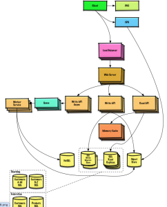

### 규칙
- 실습 Repo : https://github.com/OsoriAndOmori/developer-guide-spring
- 실습생은 자기 새로운 repo 를 파고 시작
- Java 건 kotlin 이건 알아서
- 팀원들에게 주기적으로 배운 내용 공유 & 피드백 받기
- 하면서 가이드 외 학습 추가 (security, webflux, kotlin 등등)

1. 네트워크
- HTTP
  - [HTTPS](https://aws-hyoh.tistory.com/38)
  - HTTP 1.1
  - 주요 Header 들
- 고급) HTTP 2.0, HTTP 3.0
- TCP/IP
  - 고급) UDP 란?

2. Spring Framework
- Servlet
  - apache-tomcat 다운 받기
  - `jakarta.servlet-api` dependency 하나만 추가후, tomcat 에 띄워서 hello 응답받아보기
- spring-framework-mvc, war 로 빌드 후 띄워보기
- embeded-tomcat dependency 추가후, 직접 수동으로 Spring Container 만들어서 Embeded tomcat + dispatcher Servlet 붙여보기

3. Spring-Boot
- boot 로 전환해보기
- spring 에서 autoconfigure 을 어떻게 해주는지 파악해보기 (사용법 말고, 어떻게 auto configuration 들을 코드상에서 찾아서 넣는지)
  - importSelector
- 유용한 기능 autoconfigure 해주는 starter 하나 직접 만들기
  - gitlab repo 에 jar 업로드하고, repo 로 추가하여 다른 프로젝트에서 다운 받아보기

4. Spring 학습 이후 다시 생각해보기
- spring bean 에 관한 기본적인 내용들
  - 싱글톤
  - Spring container : 구글링 해서 할 수 있는 곳 까지 직접 구현해보자 : [샘플](https://github.com/OsoriAndOmori/playground-spring/commits/main/)
- **객체지향**과 Spring
  - 스프링은 왜 만들어졌을까
- 객체지향 : 역할 책임 협력
  - 역할 책임 협력을 하게되면 의존성을 서로 가지게 된다.
  - 인터페이스는 귀찮기만하고 뭐하는걸까 대체
  - **SOLID**
  - **의존성 주입(DI)과 의존성 역전(DI)**에 관한 심도있는...
  - 객체지향의 대표적인 안티패턴
    - 순환참조
  - **레이어드 아키텍쳐와 스프링**
    - 양방향 레이어드 아키텍쳐
    - 스마트UI 아키텍쳐
  - 스프링의 특징
    - DI
    - IoC
    - AOP
    - PSA
<details>
<summary>강의 노트</summary>
```
- 지난시간 요약
    - SOLID
    - 의존성 주입, 의존성 역전
        - InterfaceTestConfigTest.java
    - 한 줄 요약 하자면 : 인터페이스를 잘 써서 의존성을 '약화' 시키고, 클래스를 많이 쪼개는 버릇을 들이자
        - UserSerive 이딴거 금지. 오늘 만들고왔으면 가서 네이밍 변경하던가, 더 쪼갤것
- 샘플 코드를 먼저 좀 보자
  - TeamTest.java
  - ApplicationWebMvcApplication.java
- 순환 참조 좀 있으면 안되냐? -> 안됨
  - 예상하지못하는 에러 발생
  - 시스템 복잡도를 높임
  - 무조건 재설계하자
- 레이어드 아키텍쳐
  - controller, service, repository
  - 구분해놨는데, 다른프레임워크도 보통 이래.. nextjs 보고오자
  - 완전 내 의견으로 c,s,r 의 레이어구분 : 완전 비판적으로 받아들이세요.
    - c 최대 3줄
    - application service 비즈니스로직인데, 남은 비즈니스로직을 실행만 딱딱 시켜주는애 , domain service
    - r 은 persistent layer
- 내가 생각하는 webflux 기준 레이어드 아키텍쳐
- smart ui 디자인패턴이 되지말자
  - 트랜잭션 스크립트
- 요약
  - 레이어드 아키텍쳐를 기억하자
  - 설계후 개발하는걸 습관해보자 interface 적극 활용
    너무 활용했을때 복잡도 높이면 어떡해? 코드 퀄리티 망하는것도 경험해봐야해.
  - 스프링 core 자체 부트캠프는 여기까지, 이후 공부 추천하는 방법 : 인프런에서 마구마구 사며 반복 학습, 빠르게 스킵하고 알짜만 계속 주워먹는다.
```
</details>

5. Spring Batch
- 그냥 배치돌리는 API 를 jenkins 로 호출해버리면 안됨?
- chunk oriented 개념
  - 그럼 언제 써야할까
- 간단한 스프링 배치 구조와 사용법
- 고급) 싱글쓰레드 배치, 멀티쓰레드 배치
  - synchronized
- 초 대용량 배치는 어떻게 하면 좋을까. 유저 데이터 억건 이런거

6. DB
- 데이터 설계 : 한 테이블에 다 때려넣기 vs 교과서대로 테이블 분리
  - 장단점 생각해보기 (정규화와 역정규화)
  - [정규화](https:/velog.io/@wisdom-one/정규화Normalization)
- [isolation](https://joont92.github.io/db/%ED%8A%B8%EB%9E%9C%EC%9E%AD%EC%85%98-%EA%B2%A9%EB%A6%AC-%EC%88%98%EC%A4%80-isolation-level/), propagation 실습
- Spring AOP 와 트랜잭션
  - [spring 없을때 트랜잭션 코드 살펴보기](https://yunaaaas.tistory.com/24)
  - ProxyTransactionManagementConfiguration, TransactionInterceptor, TransactionManager
- 테이블, 컬렉션 index 는 어떻게 설정해야 할까
  - cardinality 와 b+트리
<details>
<summary>강의노트</summary>
```
- propagation
  - REQUIRED - 트랜잭션이 필요해, 생성 + 만나면 기존거에 참여
  - REQUIRED_NEW - 새 트랜잭션이기 때문에, 커넥션 고갈야기 할 수도잇음
- index
  - index : '정렬'이 되어있어야함 + 그리고 실제 data disk 주소를 들고있어야함.
  - 정렬하면 list 로만 될까?
  - 왜 hashMap 을 안썼을까 O(1) 인데 -> 시간남으면 hashMap ? hash
```
</details>

7. 캐시와 타임아웃
- 글로벌 캐시와 로컬 캐시
  - 스프링 로컬캐시 caffeine, ehcache
  - 글로벌 캐시 redis, nginx, varnish 등
- 각 네트워크 단계마다 다양한 타임아웃 설정들
  - db
  - api
  - webserver
  - 클라이언트에서 서버까지 뒤로 갈 수록 타임아웃은 어떻게 해야할까

8. Web / Proxy
- 프록시, 리버스 프록시 개념.
- 웹서버 (nginx 등) vs 웹어플리케이션 서버
  - 웹 어플리케이션과 웹서버 같이 썼을 때 해주면 좋은 것들, 로컬에서 한번 붙여보세요
- 우리팀은 보통 어떻게 쓰는가

9. 화면 렌더링 : SSR CSR SEO 풀스택 개발자가 되기위한 첫걸음?
- 서블릿 프로그래밍 떄부터 이전 화면 렌더링 전략들
- 대세 thymleaf 와 react
  - SSR, CSR 의 장점과 단점
- 개발자의 부족한 디자인 감성으로 화면 만들때 도와주는 도구들

10. Code Deploy
- 여러대에 배포를 하려면 어떤 전략이 있을까
  - rolling, blue/green, canary
- LoadBalancer, Health check
  - 좀 더 복잡한 구조일 때 효율적인 배포한번 봐보기
- ansible 사용법 : 남이 작성한 것 플로우 따라가보기
- 실제 2대 서버로 무중단으로 배포해보기
  - 마음대로 조작해보자
- 시간남으면 k8s 배포해볼까

11. 로깅
- spring application 로그 설정
- docker compose 를 활용해 elasticsearch 에 로그 넣기
  - fluentbit -> fluentd -> elasticsearch 관계 알기
  - 좀 다르게 loki 쓰고 grafana 로 보기
  - slack 알람까지 연동

12. 모니터링
- 실습 repo 이용하여 grafana, micrometer, prometheus 연동하고 각각 뭔지 파악하기
  - dashboard import 해보기
  - 일부러 dbcp 소진하고 모니터링 해보기
  - jvm heap 메모리 전부 소비하고 모니터링 해보기
  - 수집 주기 관련 중요한 내용
- 우리서비스에서 어떻게 적용되어있는지 확인
- tracing pinpoint
- jvm heap dump 분석

13. 테스트
- TDD 란?
  - TDD 까지 해야하는가?
  - 시연
- Mocking 에 관하여
- 테스트코드를 많이 짜기만한다고 되나
  - given, when(stub), then, assert, verify 가 한 화면에
  - 테스트 데이터 generate 하는 부분은 별도 class 로 빼자
  - fixture-monkey 적극 이용하자
- 자기 repo에 테스트 Coverage 기능 추가해보기

14. 아키텍쳐 설계해보기
- 자기가 네이버 메인 개발자라면 설계해보기
  - 각자 할겁니다. 자기 노트북 스케치북이건, 노트건, drawio 건 깔아오세요
  - DB, Cache 뭐 카프카 이런거 알아서~ 정해요. 어드민도 필요하면 어드민도 만들어야함.
  - 아래같은 그림을 만드는 느낌으로
  - 필요한 서버 대수도 한번 가늠해보셈
    

15. 성능 테스트
- 많이 쓰이는 성능테스트 툴들
  - ngrinder
  - locust
  - k6
- 우리팀 성능테스트
- 테스트 관련 숫자들
  - vuser (active user) : 충분한 트래픽을 집어넣어야함. 점점 올려서
  - duration : 최소 2~3분? 짧게 실행하면 모르는 혹시나 모르는 메모리릭 같은거 확인
  - ramp up : 경험상 별로 상관없는듯. 한방에 막 집어넣으면 초기 TPS 가 떨어지긴함.

16. 코딩 스킬 & 습관
- 좋은 코드 쓰는 법
  - 함수형 특징을 머리의 새기자
  - 불변성
  - 순수함수 - 부수효과 X (Exception 던지고 받고 하지 마세요)
- 비전문가에게 설명하는 코드
- 매일 15분 정도 표준 라이브러리, spring 코드 뒤져보기
- 미학적으로 보기 좋은 코드가 좋은 코드
- 리팩토링 연습
  - 팀 내 마음에 안드는 코드 같은게 있으면 리팩토링 해보자
  - 리팩토링할 메서드 전에 테스트코드 감싸기
- 코드를 아름답게 짜는 방법은?
  - (필수) 읽기 좋은 코드가 좋은 코드다
  - (선택) 리팩토링
  - 고급) 함수형 프로그래밍이란? 저도 아직 잘 모르겠음.
- 디자인 패턴 : https://refactoring.guru/ko
  - 팩토리
  - 프록시
  - 커맨드
- 개인적인 공부방법

17. 코딩 스타일과 팀 생활
- 동료와 개발 의견이 다를땐 어떻게 해야하나.. 저도 아직 잘 모르겠음.
  - 코딩 스타일의 차이가 있을 때
  - 설계 차이가 있을 때
- 모르는건 동료 개발자에게 바로 물어봐야할까?
- 계몽 vs 전염 뭐가 더 좋은지 의미 생각해보기
- 성장한다는건 뭘 하는걸까
  - 새로운것을 배움? 과거의 잔재를 버림?
- 개발자의 역할은 뭘까
  - 요구되는 비즈니스 구현이 먼저냐 vs 기술부채 해결하여 안정적이고 우아한 시스템 구현이 먼저냐
- 예쁜 문서화가 업무에 영향을 미치는 것
  - 맨날 변하는 스펙 문서화하는게 시간이 너무 걸리는데 어떡하지?

### 더 알아보면 유용할 주제
1. Docker
- mysql 직접 다운받아서 어플리케이션으로 로컬에서 띄워보자
- 원하는거 daemon 위에 띄워주는거라고 생각하고 mysql 띄우고, database IDE 를 이용해서 접근
- 자기 repo 내 docker-compose.yml 로 띄워보기
- 어플리케이션 만든거 docker image 로 만들어서 개인 docker hub push 해보자.

2. Webflux
3. Kotlin
4. Kubernetes
5. Front End
