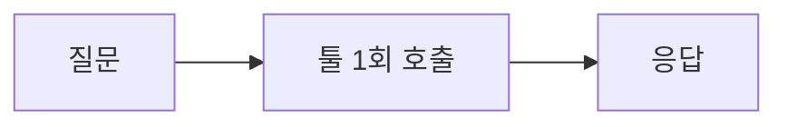
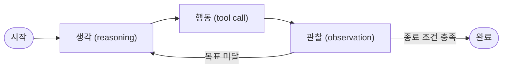
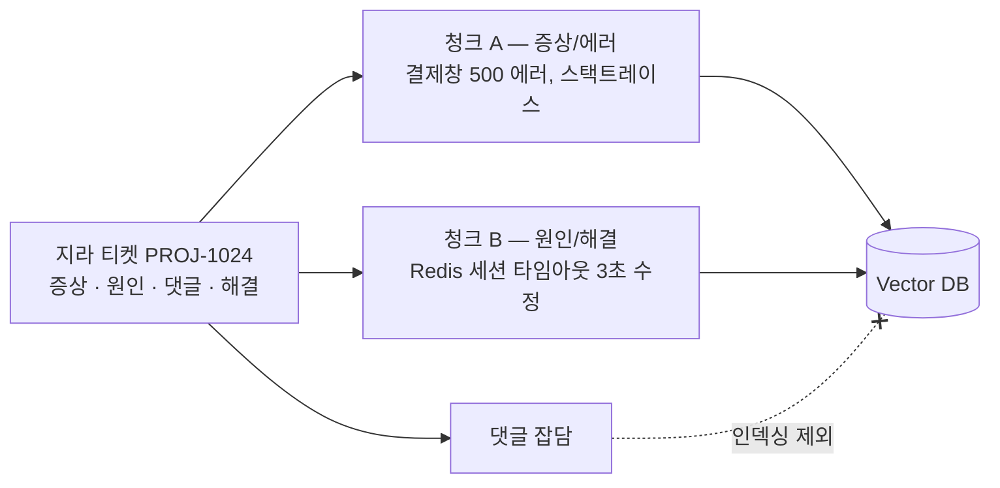
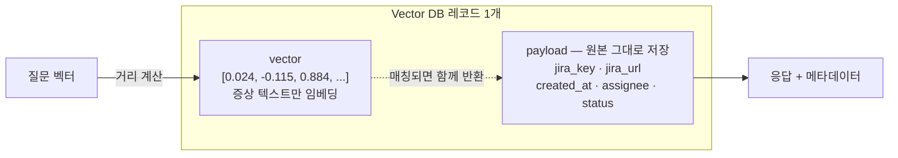
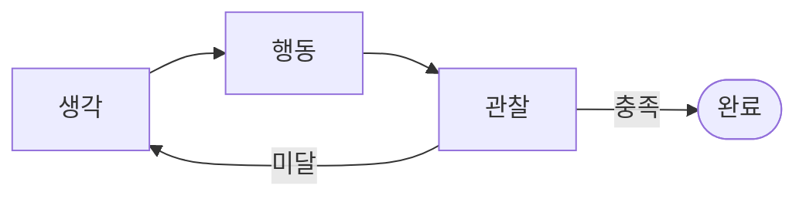

회사에서 "AI 에이전트 만들자"는 요구가 나오면서, 챗봇과 에이전트가 기술적으로 뭐가 다른지,
왜 프롬프트를 길게 쓴다고 되는 게 아닌지, RAG를 왜 쓰는지 정리했다.
사람들이 자주 오해하는 지점 위주로 적었다.

## 1. 챗봇과 에이전트의 차이

시스템 프롬프트에 규칙을 잔뜩 쓰고 MCP 툴 몇 개를 붙인 것은 **1회성 툴 호출(Linear)** 구조다.
`질문 → 툴 호출 → 응답`으로 한 번 흐르고 끝난다.

에이전트는 **목표가 충족될 때까지 스스로 반복하는 제어 루프**를 가진다.
`생각(reasoning) → 행동(tool call) → 관찰(observation) → 다시 생각`을 종료 조건까지 돌린다(ReAct 루프).
상태를 들고 분기하는 State Machine에 가깝다.


_챗봇: 질문 → 툴 1회 → 응답으로 끝나는 선형 구조_


_에이전트: 종료 조건까지 생각·행동·관찰을 반복하는 제어 루프_

다만 완전 자율 에이전트는 관리 비용과 환각 리스크가 크다.
행동 범위가 열려 있으면 어느 단계에서 왜 틀렸는지 추적하기 어렵다.
그래서 실무의 현실적인 형태는 **자유도를 제한한 워크플로우형 에이전트**다.
가능한 행동 집합을 좁게 정의하고 그 안에서만 루프를 돌린다.

## 2. LLM은 Stateless다

모델 자체에는 메모리가 없다. 각 API 호출은 독립적이고, 순수 함수처럼 입력만으로 결과가 정해진다.
이전 턴에 무슨 말을 주고받았는지 모델 내부에 남지 않는다.

대화가 이어지는 것처럼 보이는 이유는, **매 호출마다 이전 대화 전체와 사내 규칙을
질문 앞에 다시 붙여서 통째로 전송하기 때문**이다. "기억"은 클라이언트가 만드는 착시이고,
그 분량은 전부 입력 토큰으로 청구된다.


_턴이 쌓일수록 누적 데이터가 매 호출마다 반복 전송되고 비용이 함께 커진다_

### README 떡칠의 3가지 문제

시스템 프롬프트든 `README.md`든 프로젝트 컨텍스트 파일이든, API 호출 시점에는 전부
"질문 앞에 붙는 텍스트 덩어리"로 변환된다. 이름만 다를 뿐 100% 토큰을 차지한다.

1. **고정 입력 비용**: 규칙 문서가 10,000토큰이면 "안녕" 한마디에도 매 요청 10,000토큰이 입력으로 청구된다.
   대화가 N턴이면 N번 중복 과금된다.
2. **Attention 희석 (Lost in the middle)**: 배경지식이 수만 토큰이면
   "출력은 JSON 고정", "사내 DB는 읽기 전용" 같은 핵심 규칙이 긴 문맥에 묻혀 무시되기 시작한다.
3. **도구 스펙과의 경합**: MCP를 붙이면 각 툴의 이름·설명·인자 스키마도 전부 컨텍스트에 텍스트로 들어간다.
   거대한 README + 다수의 MCP 스펙이 겹치면 질문 전에 이미 수만 토큰을 소비해 TTFT가 늘어난다.

### 우회 1: 프롬프트 캐싱

**캐싱하는 주체는 모델이 아니다.** 모델은 여전히 Stateless다.
캐싱은 **API 제공자(Anthropic·OpenAI 등)의 추론 서버**가 제공하는 기능이고,
클라이언트가 하는 일은 "이 앞부분은 잘 안 바뀌니 캐시해도 된다"고 표시하는 것뿐이다.

동작 원리:

- LLM은 입력 토큰을 처리하면서 각 토큰의 어텐션 상태(KV 캐시)를 계산한다. 프롬프트가 길수록 이 계산이 비싸다.
- 제공자 서버는 **프롬프트 접두사(prefix)가 이전 요청과 동일하면** 그 구간의 KV 캐시를 재계산하지 않고 저장해둔 것을 재사용한다.
- 접두사가 정확히 일치해야 하고(한 글자만 달라도 그 지점부터 캐시 미스), 보관 기간은 짧다(예: Anthropic 기본 5분, 옵션 1시간).

비용·속도:

- 캐시 적중분은 일반 입력 토큰의 10% 안팎 가격으로 청구된다(쓰기는 첫 1회만 살짝 더 비쌈).
  30k 토큰짜리 규칙 문서를 매 턴 새로 넣으면 매번 30k 입력 요금이지만, 캐시가 맞으면 그 구간 비용이 대부분 사라지고 TTFT도 크게 준다.
- 그래서 규칙 문서 떡칠을 유지해야 한다면 캐싱은 선택이 아니라 필수다.
  단, 앞부분에 날짜·랜덤 값처럼 매번 바뀌는 걸 넣으면 캐시가 계속 깨진다 — **고정 블록은 앞, 바뀌는 부분은 뒤**에 둔다.
- Anthropic은 `cache_control`로 캐시 지점을 명시하고, OpenAI는 일정 길이 이상 프롬프트에 자동 적용된다.

### 우회 2: 문서를 MCP 도구로 격하 (Just-in-Time Context)

배경지식을 전부 시스템 프롬프트에 넣는 대신, **사내 문서를 MCP 서버 하나로 감싸서 도구로 노출**한다.

- 시스템 프롬프트에는 "사내 규칙 3~5줄" + 그 MCP 도구 스펙만 둔다.
- MCP 서버는 `search_docs(keyword)`, `read_doc(path)` 정도의 함수를 제공한다. 내부 구현은 파일 검색이든 작은 RAG든 상관없다.
- 에이전트가 질문을 보고 필요할 때만 그 도구를 호출해 관련 문단만 컨텍스트로 가져온다.

효과와 트레이드오프:

- 질문받기 전 고정 비용이 "규칙 몇 줄 + 도구 스펙"으로 줄고, 문서가 100배 커져도 시작 컨텍스트는 그대로다.
  §4의 Claude Code가 짧은 `CLAUDE.md` + Grep/Read 도구로 동작하는 것과 같은 구조다.
- 대신 질문마다 도구 호출 1~2회가 붙어 왕복(턴)이 늘고, 검색이 틀리면 엉뚱한 문단을 가져온다.
  그래서 정말 자주 쓰는 핵심 규칙은 3~5줄로 상주시키고 나머지만 도구로 뺀다.

이 "필요할 때만 로드" 패턴을 폴더 규약으로 표준화한 것이 스킬(Skill)이다 (§6).

## 3. 추론 토큰: 생각하는 과정도 과금된다

컨텍스트를 넘기고 모델이 "생각하는 시간"은 공짜일까? 모델 종류에 따라 다르다.

- **일반 모델 (Claude Haiku, GPT-4o 등)**: 첫 토큰까지의 계산 시간(TTFT)은 있어도 과금되지 않는다.
  입력 토큰과 실제 출력 토큰만 청구된다.
- **추론 모델 (o1/o3, Gemini Thinking 등)**: 답변 전에 Chain-of-Thought를 텍스트로 생성하며,
  이 분량이 **추론 토큰(reasoning tokens)**으로 100% 과금된다. 화면에서 가려져도 출력 토큰으로 계산되고,
  단가도 일반 출력보다 2~4배 비싼 경우가 많다.
- **하이브리드 모델 (Claude Sonnet/Opus 등)**: 하나의 모델이 두 모드를 오간다. 평소엔 일반 모델처럼
  바로 답하다가, "확장 사고(extended thinking)"를 켜거나 문제가 복잡하다고 판단되면 그때만
  Chain-of-Thought를 생성하고 그만큼 과금된다. "이 모델은 추론 모델이다/아니다"로 딱 잘라 말할 수
  없고, 상황에 따라 둘 중 하나로 동작한다.

따라서 단순 분기나 티켓 검색 같은 워크플로우에 추론 모델(또는 추론 모드를 켠 하이브리드 모델)을 붙이면
비용과 지연이 크게 뛴다. 오케스트레이션·툴 호출에는 가벼운 일반 모델을 쓰고, 복잡한 논리나 디버깅이
필요한 특정 단계에만 추론 모드를 제한적으로 켠다.

## 4. Claude Code는 큰 프로젝트를 어떻게 다루나

§2의 "조회 도구로 격하"가 실제로 어떻게 동작하는지는 Claude Code가 좋은 예다.

**"루트에 규칙 md 파일을 두면 그 하위 모든 코드가 컨텍스트로 넘어가나?"** → 아니다.
디렉터리를 통째로 읽지 않는다. Claude Code는 §1의 "도구를 쥔 ReAct 루프 에이전트"이고, 필요한 파일만 스스로 골라 연다.

**세션 시작 시 컨텍스트에 고정으로 들어가는 것**

- `CLAUDE.md` 같은 프로젝트 규칙·설정 파일
- 시스템 프롬프트 + 도구(Bash, Grep, Read/Write 등) 스펙
- 파일·디렉터리 구조 트리 요약본

**들어가지 않는 것**: 실제 소스 코드(`.ts`, `.py`, `.java` …), `node_modules`·`build`·`.git` 같은 대형 라이브러리·바이너리, 나머지 문서·이미지.

**코드를 찾아 읽는 순서**

1. 질문 접수 — "로그인 실패 시 리다이렉트 안 되는 버그 고쳐줘"
2. 탐색 — 전체를 읽지 않고 Glob/Grep(ripgrep)으로 `login`, `redirect`가 들어간 경로만 먼저 찾는다
3. 선택적 읽기 — 의심 파일 1~2개(`auth.ts`, `login.tsx`)만 Read로 연다. 이때 읽은 분량만 컨텍스트에 추가된다
4. 수정·실행 — 고치고 테스트를 돌려 통과하면 종료

뒤에 나올 RAG의 "필요한 페이지만 뜯어 주입"과 같은 구조다.
차이는 검색·선택을 미리 만든 파이프라인이 아니라 에이전트가 런타임에 직접 한다는 점이다.

**"디렉터리가 커지면 무조건 컨텍스트를 많이 먹나?"**

- 시작 시점: 거의 영향 없다. 파일이 1,000개든 10,000개든 시작 컨텍스트는 수천 토큰 수준이다.
- 작업 중: 프로젝트 크기가 아니라 **작업을 풀려고 몇 개의 파일을 열었는가**에 비례해 늘어난다.

**대형 프로젝트에서 실제로 생기는 문제 2가지**

1. **탐색 삽질로 인한 누적**: 구조가 복잡하면 엉뚱한 파일을 여러 개 열어보느라(Grep 실패 → 다른 파일 → 또 다른 파일) 턴이 길어지고,
   그동안 읽은 텍스트가 대화 이력에 쌓여 컨텍스트가 차오른다.
2. **`CLAUDE.md` 자체의 크기**: 하위 소스는 안 들어가도 루트 `CLAUDE.md`는 매 턴 100% 들어간다.
   API 스펙·사내 가이드·컨벤션을 백과사전처럼 떡칠하면 파일 탐색 전에 고정 비용이 크게 발생한다 — §2의 README 떡칠과 같은 문제다.

## 5. 에이전트 제품들은 결국 같은 루프다

ChatGPT 앱, Claude Code, Hermes, OpenHands는 전부 **"LLM + 도구 + 루프"라는 같은 뼈대**를 쓴다.
기본 LLM 호출 위에 `while` 루프 + 환경(샌드박스·도구) + 상태 관리 + 스킬 최적화를 얹어 하나의 제품으로 완성한 것들이고,
차이는 어떤 환경에 최적화했느냐뿐이다.

| 제품 | 대상 | 인터페이스 | 특화 | 격리 |
| --- | --- | --- | --- | --- |
| ChatGPT 앱 | 일반·비즈니스 | 채팅 UI | 웹 검색, 코드 인터프리터, 이미지 생성 | 백엔드 Jupyter 샌드박스 |
| Claude Code | 개발자 | 터미널 CLI | ripgrep·bash·git 제어, 프롬프트 캐싱 | 로컬 파일시스템(권한 제어) |
| Hermes Agent | 개발자(OSS) | CLI/스크립트 | 성공 절차의 동적 Skill 생성·저장 | 로컬 |
| OpenHands (구 OpenDevin) | 개발자(OSS) | 웹 IDE | 브라우저·터미널·에디터 번갈아 조작, 장기 루프 | Docker 컨테이너 |

### ChatGPT 앱도 껍데기만 챗봇이다

대화창 하나처럼 보여도 질문 하나에 백엔드에서 에이전트 루프가 돈다.

1. **라우팅**: 학습 지식으로 바로 답할지, 웹 검색할지, 파이썬을 돌릴지 스스로 판단
2. **행동·관찰**: 검색어를 만들어 검색 → 결과가 부족하면 검색어를 바꿔 재검색(루프). CSV를 올리면 샌드박스에서 파이썬을 작성·실행
3. **자기 수정**: 코드 실행이 에러나면 사용자에게 던지지 않고, 에러 로그를 보고 코드를 고쳐 재실행(성공까지 내부 루프)
4. **합성**: 데이터·그래프·분석 결과를 조합해 렌더링

### 예외: SDK는 에이전트가 아니다

`openai.chat.completions.create(...)` 나 Anthropic SDK 호출 자체는 **1회성 I/O 함수**다. 루프도 상태도 없다.
모델이 "이 도구 실행하고 싶다"(tool call)고 응답해도 SDK는 대신 실행해주지 않는다.
그 도구를 실행하고 결과를 다시 모델에 먹이며 종료까지 `while`을 도는 제어 코드를 개발자가 직접 짜야 비로소 에이전트가 된다.
SDK는 엔진 부품, 에이전트는 바퀴·운전대·제어기까지 단 완성차다.

## 6. 스킬(Skill)의 본질

스킬의 본질은 **한 번 성공한 작업 절차를 코드나 지시문으로 굳혀 디스크에 두고, 다음부터는 추론 없이 그대로 실행하는 것**이다.
Claude Code의 Agent Skills, Voyager(마인크래프트 에이전트), AutoGen 등에서 말하는 스킬이 다 이 범주다.

### 왜 필요한가

- **추론 낭비**: "Jira에서 특정 라벨 이슈를 긁어 슬랙 포맷으로 변환" 같은 작업을 시킬 때마다
  LLM이 5~10턴씩 툴을 찔러보며 푸는 건 비싸고 느리다.
- **비결정론적 실패**: 어제는 됐는데 오늘은 파라미터를 틀리게 넣어 에러난다.

한 번 성공했으면 그 과정을 함수 하나(`skills/jira_to_slack.py`)로 박제하고, 다음부터는 그 스크립트만 실행하면 된다.
사람이 자주 쓰는 명령을 `bin/`에 셸 스크립트로 모아두는 것과 같은 행위를 에이전트가 스스로 하는 것이다.

### 두 가지 형태

| 구분 | 사람이 작성 (Claude Code Agent Skills) | 에이전트가 작성 (Voyager류 skill library) |
| --- | --- | --- |
| 만드는 주체 | 개발자가 `SKILL.md` + 스크립트를 미리 작성 | 에이전트가 작업하다 성공한 절차를 스스로 코드화 |
| 늘어나는 방식 | 저장소에 커밋할 때 | 경험이 쌓이며 런타임에 동적으로 |

동작 사이클은 같다. **성공 → 재사용 가능한 코드/문서로 저장(상단에 설명 기록) → 유사 요청 시 그 스킬을 호출.**

### Tool/MCP와의 차이

- **Tool/MCP**: 개발자가 미리 만든 원자적(atomic) 블록(`bash_exec`, `file_read`, `curl`). 시스템 시작 시 고정.
- **Skill**: 그 원자적 도구들을 엮은 복합 레시피/매크로. 경험에 따라 동적으로 늘어난다.
- 레고 블록(Tool) vs 블록을 조립해 완성해 둔 자동차 키트(Skill).

### 컨텍스트 관점

스킬이 100개, 1,000개 쌓여도 시작 컨텍스트는 거의 안 는다. 설계 자체가 그렇게 돼 있다.

- 코드 본문은 컨텍스트에 넣지 않는다. `skills/deploy_k8s.py` 파일로 디스크에만 둔다.
- 프롬프트에는 스킬 이름 + 한 줄 요약만 목차처럼 가볍게 노출한다.

```
- jira_reporter: 특정 스프린트 이슈를 슬랙용 마크다운으로 추출
- aws_log_parser: 특정 시간대 500 에러 로그 추출
```

- 모델이 "jira_reporter 쓰면 되겠다"고 판단하면 그 스크립트를 Bash로 실행(`python skills/jira_reporter.py`)할 뿐이다.

즉 스킬 = **에이전트가 참조하는 커스텀 라이브러리이자 매크로 함수**.
매번 추론 토큰을 태워 비싸게 푸는 대신, 한 번 푼 문제는 결정론적 코드로 박제하고
다음부터는 CPU만 돌려 싸게 해결하는 최적화다.
§2의 progressive disclosure(메타데이터는 항상, 본문은 필요할 때만, 코드는 읽지 말고 실행)와 같은 원리다.

## 7. RAG를 쓰는 이유

RAG가 표준이 된 1차적인 이유는 정확도가 아니라 **컨텍스트 비용 절감**이다.
전체 문서를 매번 주입하는 대신, 질문과 관련된 일부만 검색해 주입한다.
(시험장에 백과사전을 통째로 들고 가는 대신 필요한 페이지 몇 장만 뜯어 가는 것과 같다.)

사내 문서가 A4 500페이지(약 30만 토큰)라고 가정하면:

| 구분 | 전체 주입 | RAG |
| --- | --- | --- |
| 방식 | 질문마다 30만 토큰 전송 | 관련 단락 2~3개(약 1,000토큰)만 전송 |
| 입력 토큰 | 약 300,100 | 약 1,100 |
| 비용 | 질문당 수백~수천 원 | 질문당 몇 원 |
| 지연 | 30만 자를 매번 처리 | 1,000자만 처리 |
| 정확도 | 무관한 내용 참조로 환각 유발 | 관련 문맥만 참조 |

### 성패는 모델이 아니라 데이터 파이프라인에서 갈린다

RAG 품질의 대부분은 **문서를 어떻게 자르고(Chunking) 어떻게 인덱싱했는가**에서 결정된다.
검색기(Vector DB)는 문서 전체를 이해하지 않고, 미리 잘라놓은 청크 단위로만 유사도를 계산한다.

- **청크 크기**: 너무 작으면(예: 100자) 검색 정확도는 높지만 문맥이 잘려 환각이 난다.
  너무 크면(예: 2,000자) 문맥은 풍부하나 노이즈가 섞여 엉뚱한 청크가 검색되고 토큰도 낭비된다.
  문서 성격에 맞춰 문단·마크다운 헤더·코드 블록 단위로 자르는 파이프라인이 필요하다.
- **포맷 파싱**: 실무 문서는 깨진 PDF, 병합 셀이 많은 표, PPT 다이어그램이다.
  표를 평문으로 긁으면 행·열 관계가 사라지므로 Markdown/HTML 구조로 보존해야 한다.
- **하이브리드 검색**: 벡터 검색은 의미·뉘앙스에 강하지만 고유명사나 에러 코드
  (`NullPointerException`, `ORD_2026_09`)에 약하다. 키워드 검색(BM25)은 그 반대다.
  두 결과를 합치고 Reranker로 재순위화한다.

### 청킹이 중요한 이유: 벡터 희석(Dilution)

임베딩 모델은 입력 텍스트를 고정 차원(예: 1536)의 벡터 하나로 압축한다.
짧고 단일 주제인 텍스트는 특징이 뚜렷하게 남지만,
길고 여러 주제가 섞인 텍스트는 주제들의 평균값이 되어 개별 특징이 흐려진다. 이것이 희석이다.


_단일 주제는 또렷한 벡터로, 여러 주제가 섞이면 흐릿한 평균 벡터로 압축된다_

지라 티켓 하나에는 보통 성격이 다른 정보가 섞여 있다.

1. 증상: "결제창에서 500 에러 발생"
2. 원인: "Redis 세션 타임아웃 설정 누락"
3. 댓글: "확인 부탁드려요", "스테이징 배포 언제 되나요?", "로그 첨부합니다"
4. 해결: "타임아웃 3초로 변경 후 해결"

티켓 전체를 한 청크로 임베딩하면 그 벡터는 'Redis 세션 문제'가 아니라
증상·에러·일정 논의·인사말이 뒤섞인 평균 지점을 가리킨다.
이후 "Redis 타임아웃 에러"로 검색하면 댓글 노이즈에 밀려 상위에 걸리지 않는다.

의미 단위(Semantic Boundary)로 분리하면:



"결제 500 에러" → 청크 A, "Redis 세션 해결법" → 청크 B가 정확히 검색된다.

**전체 맥락이 필요하면 Small-to-Big(Parent-Document) 패턴을 쓴다.**
검색은 작게 쪼갠 child 청크로 하고, 하나라도 매칭되면 그 청크가 포함된 원본 티켓 전체(parent)를
꺼내 LLM에 전달한다. 검색은 좁게, 이해는 넓게.

목적이 "과거에 동일한 증상의 티켓이 있었는지 찾기"로 한정되면 해결책·댓글은 인덱싱할 이유가 없다.
지라 API에서 `Summary + Description`만 뽑아 한 청크로 묶으면 충분하고, 이때 희석이 0에 가깝다.

### 벡터와 메타데이터는 분리한다

메타데이터(JSON)는 임베딩하지 않는다. 순수 텍스트만 벡터화하고, 나머지 필드는 그 옆에 원문 그대로 저장한다.



payload에 담기는 실제 형태는 이렇다.

```json
{
  "jira_key":   "PROJ-1024",
  "jira_url":   "https://jira.company.com/browse/PROJ-1024",
  "created_at": "2026-03-15",
  "assignee":   "김개발",
  "status":     "Resolved"
}
```

검색은 질문 벡터와 저장된 vector 사이의 거리 계산으로만 이뤄지고,
가장 가까운 레코드를 찾으면 거기 붙어 있던 payload가 함께 반환된다.
(택배 상자로 치면 vector는 겉면 바코드, payload는 상자 속 내용물이다.)

JSON 전체를 텍스트로 묶어 임베딩하면 `jira_key`, 따옴표, 중괄호, 날짜 같은 포맷 문자가
벡터 계산에 섞여 다시 희석이 일어난다.

메타데이터를 별도로 들고 있으면 **사전 필터링(Pre-filtering)**이 가능하다. SQL의 `WHERE`처럼
대상을 먼저 좁히고 그 안에서만 벡터 유사도를 계산하므로 속도와 정확도가 함께 오른다.

- `created_at >= '2025-01-01'` 인 티켓 중에서만 검색
- `module == 'payment'` 인 티켓 중에서만 검색

동작 흐름:

1. 새 에러 유입 → 증상 텍스트로 Vector DB 검색
2. 유사한 과거 청크 1~3개 반환
3. payload의 `jira_url`, `jira_key`를 꺼내 응답
   → "작년 3월 PROJ-1024와 증상이 92% 일치합니다. [티켓 바로가기]"

## 8. 팀 단위 적용 순서

1. **문서량이 적을 때 (A4 10~20장, 수천~1만 토큰)**: RAG를 구축하지 말고 프롬프트 캐싱을 켠 뒤 전체 주입.
   개발 속도 면에서 압도적으로 유리하다.
2. **특정 목적의 경량 RAG**: 과거 장애/문의 검색처럼 목적이 명확한 것부터.
   증상 텍스트만 임베딩하고 메타데이터(티켓 URL·담당자·날짜)를 연동한다.
3. **단일 목적 워크플로우 툴 연동**: 검색 결과로 슬랙 알림을 보내거나 지라 티켓을 생성하는
   1~2단계짜리 워크플로우. 자유도를 좁게 제한한 상태에서 시작한다.

## 요약

- 에이전트의 본질은 프롬프트+툴 나열이 아니라 종료 조건까지 도는 제어 루프다. 실무에서는 워크플로우형이 현실적.
- LLM은 Stateless. "기억"은 매 호출마다 대화 전체를 재주입하는 것이고, 그 비용은 전부 입력 토큰이다.
- README 떡칠은 고정 입력 비용 + Attention 희석 + 도구 스펙 경합을 유발한다. 캐싱(제공자 서버가 접두사 KV 캐시 재사용)하거나, MCP 도구·스킬로 격하해 필요할 때만 로드한다.
- 추론 모델의 사고 과정도 토큰이다. 오케스트레이션은 가벼운 모델, 어려운 단계에만 추론 모델.
- ChatGPT 앱·Claude Code·Hermes·OpenHands는 모두 "LLM + 도구 + 루프"가 본질이고, 최적화한 환경만 다르다. 순수 SDK 호출은 루프가 없어 에이전트가 아니다.
- Claude Code는 디렉터리를 통째로 읽지 않는다. 시작 컨텍스트는 프로젝트 크기와 무관하고, 연 파일 수에 비례해 늘어난다. 대신 `CLAUDE.md`는 매 턴 100% 들어간다.
- 스킬은 한 번 푼 절차를 코드로 박제한 매크로다. 본문은 디스크에, 컨텍스트엔 이름 + 한 줄 요약만. 추론 대신 실행.
- RAG는 정확도 이전에 컨텍스트 비용 절감이 목적이고, 품질은 청킹·인덱싱에서 갈린다.
- 벡터는 검색용(순수 텍스트만), 메타데이터는 원본 저장 + 사전 필터링용. 둘은 분리한다.

<!-- 발표 모드 전용 슬라이드. 화면에는 보이지 않고 "▶ 발표 모드"에서만 사용됨. `---`로 슬라이드 구분, `####`가 제목. -->
<div class="slides-src" hidden markdown="1">

#### 거품 뺀 AI 에이전트

챗봇 · 컨텍스트 · RAG · 스킬의 실체

팀 세미나 · 2026-09

---

#### 1. 챗봇 vs 에이전트

- 챗봇 = `질문 → 툴 1회 → 응답` (Linear)
- 에이전트 = 종료 조건까지 도는 **제어 루프** (ReAct)
- 완전 자율은 추적 불가 → 실무는 **자유도 제한 워크플로우형**



---

#### 2. LLM은 Stateless

- 모델엔 메모리 없음. 매 호출이 독립 순수 함수
- "기억" = 매 턴 **대화 전체 + 규칙을 재주입**하는 착시
- 그 분량은 전부 입력 토큰으로 과금


---

#### 3. README 떡칠의 3가지 비용

- **고정 입력 비용** — "안녕" 한마디에도 규칙 문서 전체 과금
- **Attention 희석** — 핵심 규칙이 긴 문맥에 묻혀 무시됨
- **도구 스펙 경합** — MCP 스키마까지 더해져 TTFT 증가

---

#### 4. 우회 3가지

- **프롬프트 캐싱** — 제공자 서버가 접두사 KV 캐시 재사용. 적중 시 입력비 ~10%
- **MCP 도구로 격하** — 규칙 3~5줄 + `search_docs()` 도구. 필요할 때만 로드
- **스킬** — 위 패턴을 폴더 규약으로 표준화

---

#### 5. 추론 토큰

- 일반 모델: 생각하는 시간(TTFT)은 **공짜**, 입출력 토큰만 과금
- 추론 모델: Chain-of-Thought 분량이 **100% 과금**, 단가 2~4배
- 오케스트레이션은 가벼운 모델, 어려운 단계에만 추론 모델

---

#### 6. Claude Code는 큰 레포를 어떻게?

- 디렉터리를 **통째로 안 읽음**. Glob/Grep으로 필요한 파일만 Read
- 시작 컨텍스트 ≈ 고정 (파일 1천 개든 1만 개든 수천 토큰)
- 늘어나는 건 **연 파일 수**에 비례
- 단, 루트 `CLAUDE.md`는 매 턴 100% 주입

---

#### 7. 에이전트 제품 = 같은 루프

| 제품 | 환경 | 특화 |
| --- | --- | --- |
| ChatGPT 앱 | 채팅 UI | 검색·코드 인터프리터 |
| Claude Code | 터미널 | ripgrep·git·캐싱 |
| Hermes / OpenHands | CLI · Docker | 스킬 생성 · 장기 루프 |

- 본질은 모두 **LLM + 도구 + 루프**
- 순수 SDK 호출은 루프가 없어 **에이전트 아님**

---

#### 8. 스킬(Skill)의 본질

- 한 번 성공한 절차를 **코드로 박제** (`skills/jira_to_slack.py`)
- 컨텍스트엔 **이름 + 한 줄 요약**만, 본문은 디스크
- 매칭되면 추론 없이 `python skills/...` **실행**
- Tool = 레고 블록 / Skill = 조립된 자동차

---

#### 9. RAG를 왜 쓰나

- 1차 목적은 정확도가 아니라 **컨텍스트 비용 절감**
- 30만 토큰 전체 주입 → 관련 1천 토큰만 검색 주입
- 성패는 모델이 아니라 **청킹·인덱싱**

---

#### 10. 청킹 · 희석 · 분리

- 긴 텍스트를 한 벡터로 압축하면 특징이 **희석**
- 지라 티켓: **증상만** 임베딩, 댓글·해결책 제외
- 메타데이터는 임베딩 X → 옆에 저장 + **사전 필터링**(`WHERE`)


---

#### 11. 팀 적용 3단계

1. 문서 적음 → **프롬프트 캐싱 + 전체 주입**
2. 목적 뚜렷 → **경량 RAG** (증상 임베딩 + 메타데이터)
3. 그 위에 → **단일 목적 워크플로우 툴** (슬랙·지라)

---

#### 한 줄 요약

에이전트 개발 = 모델 튜닝이 아니라
**비결정론적 LLM의 컨텍스트·비용·환각을 엔지니어링으로 통제하는 일**

</div>
