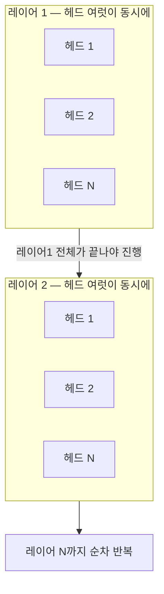
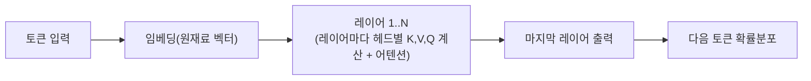
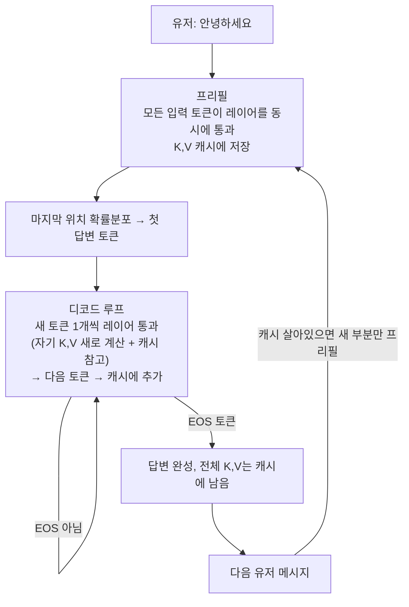

[지난 글]()에서 "대화가 길어질수록 매 턴 전체를
다시 보내야 해서 비용이 커진다"까지는 다뤘다. 근데 거길 파다 보니 자연스럽게 "그럼 프롬프트 캐싱이
정확히 뭘 저장하는 건데?"로 이어졌고, 그 질문에 제대로 답하려니 결국 트랜스포머 내부 — 임베딩,
어텐션, K/V/Q, 레이어와 헤드, 프리필과 디코드 — 까지 다 뜯어보게 됐다. 그 과정을 순서대로 정리한다.

## 캐싱은 "답변"을 저장하는 게 아니다

**흔한 오해: 프롬프트 캐싱이 "안녕하세요"에 대한 답을 저장해뒀다가 재사용하는 것.**

아니다. 그러면 같은 질문엔 항상 같은 답만 나와야 하는데, 실제로는 그렇지 않다. 캐싱이 저장하는 건
**입력 텍스트를 모델이 "읽는" 과정에서 나오는 중간 계산값**이지, 최종 답변이 아니다. 이걸 이해하려면
모델이 텍스트를 "읽는다"는 게 실제로 무슨 연산인지부터 봐야 한다.

## 토큰의 "원재료": 임베딩

토큰이 모델에 처음 들어갈 때, 룩업 테이블(임베딩 테이블)에서 그 토큰 ID에 해당하는 **고정된 벡터**를
하나 꺼내온다. 이 벡터는 순수하게 숫자 목록(`[0.12, -0.87, ...]`)일 뿐이고, 이 시점엔 문맥이 전혀
반영돼 있지 않다. "배가 고프다"의 `배`든 "배를 탄다"의 `배`든, 이 단계에서는 완전히 같은 숫자다.

임베딩 테이블 자체도 학습 때 정해지고 이후 고정되는 **모델 파라미터**의 일부다.

## 어텐션이 하는 일: 문맥에 따라 의미를 채워 넣는다

같은 단어라도 문맥에 따라 뜻이 다르다.

- "나는 배가 고프다" → 배 = 신체 부위
- "나는 배를 타고 간다" → 배 = 선박

**어텐션은 지금 보고 있는 토큰이, 문장 안의 다른 토큰들 중 어디를 얼마나 참고해야 할지 점수를
매기고, 그 비중대로 정보를 섞어서 자기 표현(벡터)을 업데이트하는 단계**다. `배가 고프다`에서 `배`는
`고프다`를 강하게 참고해서 "신체 부위" 쪽 의미로, `배를 타고 간다`에서는 `타고`를 강하게 참고해서
"선박" 쪽 의미로 벡터가 바뀐다.

## Q, K, V — 검색엔진 비유가 제일 정확하다

어텐션 내부에서는 토큰마다 세 가지 벡터를 만든다. 만드는 방식은 셋 다 동일하다 — **그 레이어에서의
은닉 벡터에 각각 다른 학습된 가중치 행렬(W_Q, W_K, W_V)을 곱한 것**뿐이다.

| 벡터 | 역할 | 검색엔진 비유 |
| --- | --- | --- |
| Query (Q) | 이 토큰이 "지금 뭘 찾고 있는지"를 나타내는 검색어 | 검색창에 입력하는 질의어 |
| Key (K) | 다른 토큰들한테 내거는 "나는 이런 정보야" 태그 | 문서에 붙은 색인/태그 |
| Value (V) | 실제로 담고 있는 내용물 | 문서의 실제 내용 |

동작 순서:

1. 토큰 i의 Q를 **문장 안 모든 토큰의 K**와 비교해서 관련도 점수를 매긴다
2. 그 점수를 비중 삼아 **모든 토큰의 V**를 가중평균해서 섞는다
3. 섞인 결과가 토큰 i의 새 표현이 되고, 다음 레이어로 넘어간다

K, V는 "남한테 제공하는" 벡터고, Q는 "내가 필요해서 찾으러 다니는" 벡터라는 게 핵심 차이다. 이 차이가
뒤에서 캐싱과 직결된다.

## 레이어와 헤드: 순차 vs 병렬

트랜스포머는 이 Q,K,V→어텐션 과정을 레이어 수십~백 번 반복하는 구조다. 여기서 두 단위를 구분해야 한다.

- **레이어**: 데이터가 순서대로 통과하는 계산 단계. 레이어 1 → 2 → ... → N 순으로, 앞 레이어가
  **전부** 끝나야 다음 레이어로 넘어간다.
- **헤드**: 한 레이어 안에서 어텐션을 여러 개의 작은 어텐션으로 쪼갠 것. 각 헤드는 자기만의 작은
  W_Q, W_K, W_V를 갖고 **완전히 독립적으로, 동시에** 계산된다. (예: DeepSeek-V3는 레이어 61개,
  헤드 128개 — 뒤에서 다시 다룬다)

헤드마다 다른 종류의 관계에 특화되는 경향이 있다 — 어떤 헤드는 주어-동사 관계, 어떤 헤드는
대명사가 가리키는 대상, 어떤 헤드는 의미적 유사성을 잡는 식이다. 이 여러 관점의 결과를 레이어마다
합쳐서 쓰기 때문에 어텐션 하나로 뭉뚱그려 보는 것보다 문맥을 훨씬 풍부하게 잡아낸다.

## 모델의 진짜 출력물은 "다음 토큰 확률분포"다 — K,V는 부산물

여기가 헷갈리기 쉬운 지점이다. 레이어를 지나며 K, V가 계산되긴 하지만, 이건 **어텐션 계산에 쓰이고
지나가는 중간 부산물**이다. 모델이 실제로 내놓는 결과물은 **마지막 레이어까지 다 지나서 나오는
다음 토큰 확률분포** 하나뿐이다.

"K,V를 캐시에 저장한다"는 건, 서버(추론 인프라)가 이 중간 부산물을 버리지 않고 **일부러 옆으로
빼서 GPU 메모리 한켠에 복사해두는 것**이다. 사람이 읽는 텍스트 로그가 아니라, `[0.024, -0.115, ...]`
같은 순수 숫자 텐서를 메모리 버퍼에 복사해두는 거라, 프로그래밍의 메모이제이션(memoization)에
가깝다 — "이 계산 한 번 했으니, 다음에 똑같은 입력 오면 다시 계산하지 말고 저장해둔 값 갖다 써"라는
그 패턴을, 텍스트가 아니라 신경망 내부 숫자 텐서에 적용한 것.

## 프리필과 디코드: 같은 파이프라인, 스케일만 다르다

이 파이프라인 자체는 프리필이든 디코드든 완전히 동일하다. 차이는 **한 번에 몇 토큰이 지나가는가**뿐이다.

- **프리필** (사용자가 보낸 프롬프트를 처음 읽는 단계): 입력 토큰 전부가 **동시에** 이 파이프라인을
  통과한다. 이때 모든 위치에서 확률분포가 다 나오지만, 실제로 쓰는 건 **맨 마지막 위치**의 확률분포
  하나뿐이다(나머지 위치의 "다음 토큰"은 이미 프롬프트에 정해져 있으니 예측할 필요가 없다). 그래서
  프리필에서 진짜로 의미 있게 챙기는 건 **K, V(캐시용)** + **마지막 위치 확률분포(첫 답변 토큰용)**다.
- **디코드** (답을 한 토큰씩 만드는 단계): 매 스텝마다 **새로 생긴 토큰 딱 1개만** 이 파이프라인을
  통과한다. 그 토큰 자신의 K,V,Q를 새로 계산하고, 어텐션에서는 캐시에 있는 이전 토큰들의 K,V를
  그대로 참고한다. 나온 확률분포로 다음 토큰을 뽑고, 방금 계산한 K,V는 캐시에 추가된다. 이걸 EOS
  토큰이 나올 때까지 반복한다.

## 왜 Q는 캐싱 안 하고 K, V만 캐싱할까

Q는 "지금 이 순간 이 토큰이 스스로 던지는 질문"이라서, 그 순간 어텐션 한 번에 쓰이고 버려진다.
다음 스텝에서 새 토큰은 또 자기만의 새로운 질문(Q)을 던질 거라, 저장해둘 이유가 없다.

반면 K, V는 "이 토큰이 남들한테 제공하는 것"이라서, 미래에 어떤 새 토큰이 오든 계속 유효하다.
그래서 캐시엔 항상 K, V만 저장되고 "QKV 캐시"가 아니라 "**KV** 캐시"라고 부른다.

## 캐시가 "안전하게" 작동하는 진짜 이유: 인과적 마스킹

여기가 가장 중요한 지점이다. 대화가 길어질수록 앞부분(예: 맨 처음 질문)의 K,V를 다시 계산해야
하지 않을까 싶지만, **그럴 필요가 없다**. 이유는 LLM이 **인과적(causal) 어텐션**을 쓰기 때문이다:

> 토큰 i는 자기 자신과 자기보다 앞에 있는 토큰만 참고할 수 있고, 뒤에 오는 토큰은 절대 못 본다
> (어텐션 계산에서 뒤쪽 토큰 점수를 강제로 무시하도록 마스킹돼 있다).

그래서 맨 처음 토큰의 K,V는 그 토큰 자신(과 그 이전 것들)만 갖고 계산되고, **그 이후 대화가
아무리 길어져도 절대 안 바뀐다**. 한 번 계산되면 영원히 유효하다는 뜻이고, 이게 바로 캐싱이 안전하게
작동하는 근본 이유다.

(참고로 RAG용 임베딩 모델처럼 양방향(bidirectional) 어텐션을 쓰는 모델은 이 보장이 없다 — 뒤에
단어가 하나 추가되면 앞 단어들의 표현까지 다 바뀔 수 있어서, 이런 식의 캐싱이 성립하지 않는다.)

## 다음 토큰 예측 = 어휘집 안에서 "가장 가까운 벡터" 찾기

마지막 레이어에서 나오는 "문맥이 다 녹아든 최종 벡터"로 다음 토큰을 정하는 과정은, 사실 RAG
검색이랑 수학적으로 같은 구조다.

| | RAG 검색 | 다음 토큰 예측 |
| --- | --- | --- |
| 쿼리 벡터 | 질문 임베딩 | 마지막 은닉 벡터 |
| 검색 대상 | 벡터 DB의 문서 조각들 | **어휘집 전체 토큰의 벡터** |
| 유사도 | 코사인 유사도 | 내적(dot product) |
| 결과 | top-k 문서 | 확률분포 → 샘플링해서 토큰 하나 선택 |

많은 모델이 입력 임베딩 테이블과 출력(다음 토큰 점수 매기는) 테이블을 아예 같은 것으로 공유한다
(weight tying). 그러니까 "다음 단어 찾기"는 말 그대로 **"지금 문맥 벡터랑 제일 가까운 토큰을
어휘집이라는 훨씬 작은 데이터베이스에서 찾는 것"**이다.

## 어휘집은 "단어 사전"이 아니라 "조립 블록 세트"

Claude의 정확한 토크나이저 스펙은 공개돼 있지 않지만, 독립 연구자들이 역추적한 바로는 Claude 5
세대 토크나이저가 약 **16,384개** 수준으로, 이전 세대(약 49,152개)보다 오히려 줄었다.

이게 "전 세계 모든 언어 합쳐서 단어 16,384개"라는 뜻은 절대 아니다. 서브워드(subword) 토큰화
덕분에, 어휘집엔 **단어**가 아니라 **단어를 조립하는 최소 블록**(흔한 통짜 단어, 부분 조각, 음절,
최후엔 바이트 단위까지)이 들어있다. 알파벳 26개로 무한한 영어 단어를 만드는 것처럼, 이 블록들을
조합하면 학습 때 없던 단어·문장도 얼마든지 새로 만들 수 있다.

다만 이게 공짜는 아니다. Claude의 어휘집이 GPT-4o 계열(약 20만 개)보다 훨씬 작다 보니, 같은 내용을
표현하는 데 더 많은 토큰(블록)이 필요해진다. 그리고 이 손해가 **언어마다 다르게** 분배된다 —
토크나이저가 영어 위주 데이터로 학습돼서, 한글은 단어 경계 없이 거의 음절 단위로 쪼개지는 경우가
많다. 그 결과 **같은 의미를 전달하는 데 한국어가 영어보다 약 1.5~3배 더 많은 토큰**을 쓴다. 토큰
단위로 요금과 컨텍스트 한도가 매겨지는 구조상, 이건 한국어 사용자한테 실질적으로 불리하게 작용한다.

## 실제 숫자로 감 잡기: DeepSeek-V3

Claude는 이런 아키텍처 세부사항을 공개하지 않지만, 오픈소스인 DeepSeek는 설정 파일 자체가
공개돼 있어서 실제 숫자를 볼 수 있다.

| 항목 | DeepSeek-V3 |
| --- | --- |
| 은닉 차원(hidden_size) | 7,168 |
| 레이어 수 | 61 |
| 어텐션 헤드 수 | 128 |
| MLP 차원 | 18,432 |

DeepSeek는 표준 어텐션 대신 **MLA(Multi-head Latent Attention)**를 쓰는데, 이게 정확히 지금까지
얘기한 "KV 캐시 용량 문제"를 겨냥한 설계다. K, V를 그대로 저장하지 않고 훨씬 작은 압축된 벡터로
줄여서 저장했다가 필요할 때 복원해서 쓴다. 레이어 61 × 헤드 128이면 KV 캐시가 그대로 두기엔
너무 크니까, 아키텍처 레벨에서 그 저장 공간 자체를 압축하도록 설계한 것.

## 전체 흐름 한 번에

## 요약

- 프롬프트 캐싱은 답변이 아니라, 텍스트를 읽으며 생기는 중간 계산값(K, V)을 서버가 저장해두는 것이다.
- 어텐션은 "지금 토큰이 문맥의 다른 토큰들을 얼마나 참고할지 계산하고 섞는" 단계다. Q(질문)로
  K(태그)를 검색해서 V(내용)를 끌어온다.
- 레이어는 순차(1→2→...→N), 헤드는 한 레이어 안에서 병렬. DeepSeek 기준 레이어 61, 헤드 128.
- 모델의 진짜 출력은 다음 토큰 확률분포뿐이다. K, V는 그 과정에서 생기는 부산물이고, 서버가 그걸
  따로 빼서 캐시에 저장한다.
- 프리필(입력 전체 병렬 처리)과 디코드(새 토큰 1개씩 순차 생성)는 같은 파이프라인을 스케일만
  다르게 쓰는 것이다.
- Q는 그 순간 한 번 쓰고 버려지지만 K, V는 미래에도 유효해서 캐싱된다.
- 이게 안전한 이유는 인과적 마스킹 — 토큰은 미래를 못 보니, 한 번 계산된 K,V는 대화가 아무리
  길어져도 절대 안 바뀐다.
- 다음 토큰 예측은 본질적으로 "어휘집이라는 작은 데이터베이스에서 가장 가까운 벡터를 찾는" RAG
  검색과 같은 구조다.
- 어휘집은 단어 사전이 아니라 조립 블록 세트고, 한국어는 이 블록 배분에서 영어보다 불리하다
  (1.5~3배 더 많은 토큰 소모).

<!-- 발표 모드 전용 슬라이드. 화면에는 보이지 않고 "▶ 발표 모드"에서만 사용됨. -->

#### 다음 토큰이 태어나기까지

임베딩 · 어텐션 · KV 캐시 해부

---

#### 0. 출발점

- 프롬프트 캐싱은 **답변을 저장**하는 게 아니다
- 저장되는 건 텍스트를 읽으며 생기는 **중간 계산값**
- 그 정체를 알려면 트랜스포머 내부를 봐야 한다

---

#### 1. 임베딩 = 토큰의 원재료

- 토큰 ID → 룩업 테이블에서 **고정된 벡터** 하나 꺼내옴
- 이 시점엔 문맥 없음. `배가 고프다`든 `배를 탄다`든 똑같은 숫자

---

#### 2. 어텐션 = 문맥으로 의미를 채우는 단계

- `배가 고프다` → `고프다`를 참고 → 신체 부위 쪽 의미
- `배를 타고 간다` → `타고`를 참고 → 선박 쪽 의미
- 지금 토큰이 다른 토큰을 얼마나 참고할지 계산 + 섞기

---

#### 3. Q, K, V — 검색엔진 비유

| 벡터 | 역할 |
| --- | --- |
| Q | 지금 토큰이 찾는 검색어 |
| K | 다른 토큰이 내거는 태그 |
| V | 실제 내용물 |

Q로 모든 K를 검색 → 점수만큼 V를 섞음

---

#### 4. 레이어는 순차, 헤드는 병렬

- 레이어: 1 → 2 → ... → N (앞 레이어 다 끝나야 다음)
- 헤드: 한 레이어 안에서 여러 개가 동시에
- 헤드마다 다른 관계(주어-동사, 지시어, 의미 유사성...)에 특화

---

#### 5. 모델의 진짜 출력 = 확률분포

- K, V는 **부산물**, 최종 산출물은 **다음 토큰 확률분포**
- 캐싱 = 서버가 이 부산물을 버리지 않고 옆으로 빼서 저장

---

#### 6. 프리필 vs 디코드

- 프리필: 입력 토큰 전부 **동시에** 통과, 마지막 위치 확률분포만 씀
- 디코드: 새 토큰 **1개씩** 통과, 나머진 캐시 참고
- 파이프라인은 동일, 스케일만 다름

---

#### 7. Q는 왜 캐싱 안 하나

- Q = 그 순간만 쓰고 버려지는 질문
- K, V = 미래에도 계속 유효한 "제공물"
- 그래서 "KV 캐시"지 "QKV 캐시"가 아님

---

#### 8. 캐시가 안전한 진짜 이유: 인과적 마스킹

- 토큰은 **미래를 못 봄** (뒤 토큰 마스킹)
- 한 번 계산된 K,V는 대화가 길어져도 **절대 안 바뀜**
- 그래서 캐시 재사용이 항상 안전

---

#### 9. 다음 토큰 예측 = 벡터 검색

- 마지막 은닉 벡터 vs **어휘집 전체 토큰 벡터**
- 내적 계산 → 확률분포 → 샘플링
- RAG 검색이랑 수학적으로 같은 구조, 검색 대상 크기만 다름

---

#### 10. 어휘집 = 단어 사전이 아니라 블록 세트

- Claude 5 세대 추정 약 16,384개 (역추적, 비공식)
- 서브워드 조합이라 무한한 단어 생성 가능
- 단, 한국어는 영어보다 **1.5~3배 더 많은 토큰** 소모

---

#### 11. 실제 숫자: DeepSeek-V3

- 은닉 차원 7,168 / 레이어 61 / 헤드 128
- MLA로 KV 캐시 자체를 압축 (같은 문제의식, 아키텍처 레벨 해법)

---

#### 정리

임베딩 → 레이어별 Q,K,V → 어텐션 → 확률분포
→ 프리필(병렬) + 디코드(순차) 반복 → EOS
→ 캐시된 K,V는 대화가 길어져도 영원히 유효

